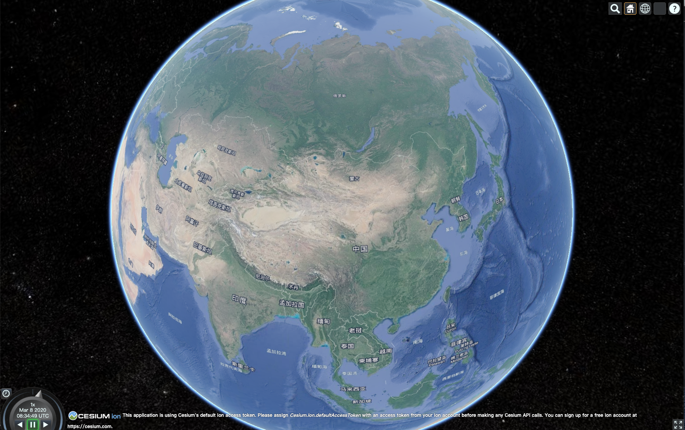
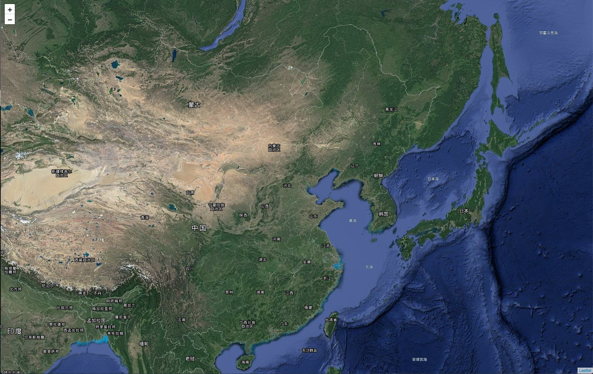
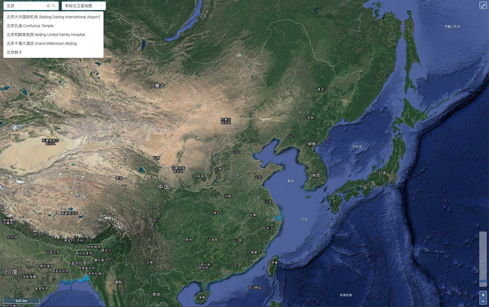

# myworld
## 个人地图  

> 包含cesium、leaflet、openlayers三个框架的地图。  
> 地图瓦片来源于google，地址解析api来源于mapbox。

### 路由
* cesium: [/myworld/cesium](/myworld/cesium)
* leaflet: [/myworld/leaflet](/myworld/leaflet)
* openlayers: [/myworld/ol](/myworld/ol)

### 运行
* 需要nodejs v8.0.0以上
* server: nginx

```bash
cd myworld

yarn

yarn start # http://localhost:8888/myworld/cesium
```

### 编译
```bash
cd myworld

yarn

yarn build
```
将dist/myworld移到对应目录下，配置nginx server。  

### 预览
* cesium


* leaflet


* openlayers
